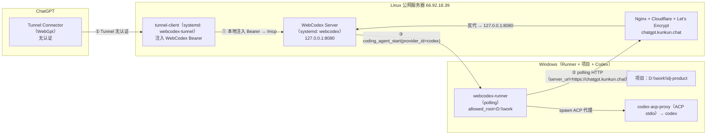

# WebGpt（chatgpt.kunkun.chat）部署记录

> 本文记录一次真实跑通的拓扑：Linux 公网服务器作 WebCodex Server，Windows 机器作 WebCodex Runner，
> ChatGPT 通过 OpenAI Secure MCP Tunnel（`WebGpt`）连接，并开启 WebCodex 的 **Coding Agent（ACP / Codex 委托）**。
> 所有截图/命令中的凭证一律以占位符 `<REDACTED>` 表示，请勿在仓库中提交真实 token。

## 1. 整体架构



三条关键通道：
- **① ChatGPT ↔ Server**：OpenAI Secure MCP Tunnel（`WebGpt`），无认证；WebCodex Bearer 由本机 `tunnel-client` 注入。
- **② Runner ↔ Server**：Windows Runner 用 `server_url=https://chatgpt.kunkun.chat`（HTTP `polling`，因为 Cloudflare 不代理 websocket 升级）。
- **③ Coding Agent**：Server 把 `coding_agent_start` 路由给 Windows Runner，Runner 拉起 `codex-acp-proxy`（ACP stdio），代理再调 `codex`。

## 2. Linux 服务器配置

### 2.1 WebCodex Server
- systemd：`webcodex.service` + `webcodex.socket`，监听 `127.0.0.1:8080`。
- 配置：`/etc/webcodex/webcodex.env`

```
WEBCODEX_ADDR=127.0.0.1:8080
WEBCODEX_DATA=/root/.local/share/webcodex
WEBCODEX_PUBLIC_URL=https://chatgpt.kunkun.chat
WEBCODEX_TOKEN=<REDACTED>
WEBCODEX_SHARED_KEY_ENABLED=true
```

### 2.2 Linux Runner
- systemd：`webcodex-runner.service`（root，`allowed_roots=["/"]`）
- 配置：`/etc/webcodex/http_127.0.0.1_8080/saigou/agent.toml`
- 服务环境：`Environment=RUST_LOG=info`、`Environment=CODEX_HOME=/root/.codex`、`Environment=HOME=/root`

### 2.3 OpenAI Secure MCP Tunnel（WebGpt）
- `tunnel_id=tunnel_6a9913b323108191b1b2cb5e67dfc7bd`（名称 `WebGpt`）
- `tunnel-client`：`/usr/local/bin/tunnel-client`（v0.0.14），systemd `webcodex-tunnel.service`
- wrapper：`/opt/openai-tunnel/run-tunnel.sh`
- 私有文件（`/root/.config/openai/`，0600）：
  - `tunnel-api-key`（OpenAI `CONTROL_PLANE_API_KEY`，Restricted，Tunnels Read+Use）
  - `webcodex-bearer`（`Bearer <wc_pat_...>`，WebCodex Bearer，仅本机注入）
  - `tunnel-health.url`、`tunnel-client.log`

### 2.4 Nginx + 证书
- 站点：`/www/server/panel/vhost/nginx/chatgpt.kunkun.chat.conf`（反代 `https://chatgpt.kunkun.chat` → `http://127.0.0.1:8080`，含 WebSocket 升级头；并加 `/webcodex-dl/` 静态下载）
- 证书：`/etc/letsencrypt/live/chatgpt.kunkun.chat`

## 3. Windows Runner 配置

### 3.1 agent.toml（位于 `%APPDATA%\webcodex\https_chatgpt.kunkun.chat\saigou\agent.toml`）

```toml
server_url = "https://chatgpt.kunkun.chat"
token = "<REDACTED>"
client_id = "pan-0cdfdbb9da7c4ddd"
owner = "saigou"
transport = "polling"            # 重要：用 polling 而非 websocket（Cloudflare 不代理 websocket 升级）
poll_interval_ms = 1000
projects_dir = '\\?\C:\Users\Administrator\AppData\Roaming\webcodex\https_chatgpt.kunkun.chat\saigou\projects.d'

[capabilities]
shell = true
file_read = true
file_write = true
git = true
jobs = true
async_jobs = true
async_shell_jobs = true
ssh_shell = false
persistent_shell = false
ssh_persistent_shell = false
structured_validation_argv = true
structured_process_argv = true
structured_script_payload = true
structured_execution_jobs = true
lsp_read_only_navigation = true
lsp_call_hierarchy = true
sandbox_inspect_commands = false
project_lifecycle = false
project_path_registration = false

[policy]
allow_raw_shell = true
allow_cwd_anywhere = false
allowed_roots = ['D:\work']
max_timeout_secs = 3600
max_output_bytes = 262144

[acp]
max_concurrent_runs = 1
permission_timeout_secs = 5

[[acp.agents]]
id = "codex"
name = "Codex"
executable = "<node.exe 绝对路径>"   # 例如 C:\Program Files\nodejs\node.exe（必须绝对路径）
args = ["D:\\WebGpt\\codex-acp-proxy.js"]
env_from_env = { "HOME" = "HOME", "CODEX_HOME" = "CODEX_HOME", "PATH" = "PATH" }
allowed_config_options = []
```

> 关键点：
> - `executable` 必须是 **node.exe 的绝对路径**（不能是 `node` 或 .js）。
> - 代理 `.js` 放在 `args`。
> - `env_from_env` 必须含 **`PATH`**（否则代理内 `spawn codex` 报 `ENOENT`）。

### 3.2 Runner 进程环境变量（启动 Runner 的 PowerShell）

```powershell
$env:HOME = $env:USERPROFILE
$env:CODEX_HOME = "$env:USERPROFILE\.codex"
# 若 codex 用 API key（非 auth.json）：$env:OPENAI_API_KEY = "sk-..."
# 若 codex 不在 PATH：$env:CODEX_CMD = "<codex 绝对路径>"
```

## 4. Coding Agent（ACP）代理

文件：`deploy/webcodex-acp-proxy.js`（本仓库）。实现 WebCodex Runner 期望的 **ACP v1（JSON-RPC 2.0 + NDJSON stdio）**：

| 方法 | 说明 |
|---|---|
| `initialize` | 返回 `{protocolVersion:1, agentCapabilities:{}}` |
| `session/new` | 返回 `{sessionId, agentCapabilities:{}}` |
| `session/set_config_option` | 校验/接受配置 |
| `session/prompt` | 调 `codex exec`，流式回 `session/update`，回 result |
| `session/cancel` | 取当前 run |

环境变量：
- `CODEX_CMD`：codex 命令路径，默认 `codex`。
- `CODEX_ACP_STUB=1`：stub 输出，用于冒烟测试（无需 codex）。

## 5. 关键配置项（`[acp]` 生效机制）

- `[acp]` 段非空 + `[[acp.agents]]` → Runner 启动 `CodingAgentManager`，并上报 **`coding_agent_runs`** 能力；否则能力缺失。
- `coding_agent_start` 需要 **`coding_agent:run`** 权威 scope（不属于默认登录 token 基础 scope）。授予方式：

```bash
webcodex tokens create --server-url http://127.0.0.1:8080 --username saigou \
  --name tunnel-full \
  --scope runtime:read --scope session:collaborate --scope project:read \
  --scope project:write --scope job:run --scope coding_agent:run
# 并把生成的 wc_pat_... 写入 tunnel 的 /root/.config/openai/webcodex-bearer，再重启 webcodex-tunnel.service
```
> 注意：`tokens create --scope` 要**重复传**（`--scope A --scope B`），不能一次空格分隔。

## 6. 已踩过的坑（重要）

| 现象 | 原因 | 修复 |
|---|---|---|
| ChatGPT 建 Connector 报 `Something went wrong` | tunnel-client 未在线 / control-plane 不可达 | 先启动 tunnel-client，再建 Connector |
| `webcodex server install` 报 `systemctl is-active failed` | 0.3.9 对全新安装 is-active 返回 inactive 处理过严 | 按 `--dry-run` 手写 `webcodex.service/socket` 再 `daemon-reload; enable; start` |
| `npm install` 下载 win 二进制 `ECONNRESET` / `EPERM rename` | GitHub 下载被重置；Defender 锁目录 | 从本机下载站拉 **自包含 CLI 包**（免 npm）+ `WEBCODEX_BINARY_DIR` / 手动放 `vendor\bin` |
| Windows Runner `websocket connect timed out` | Cloudflare 不代理 websocket 升级（返回 200 而非 101） | `transport` 改为 **`polling`** |
| `coding_agent_spawn_failed (os error 3)` | `[acp].agents.executable` 不是绝对路径 / 不存在 | 设为 node.exe 绝对路径 |
| `spawn codex ENOENT` | 代理子进程 env 被 `env_clear()`，无 `PATH`；或未装 codex CLI | `env_from_env` 加 `PATH`；`npm i -g @openai/codex` 或设 `CODEX_CMD` |
| `required ACP environment source 'HOME'/'CODEX_HOME' is missing` | Runner 进程缺这些 env | 给 Runner 进程设置 `HOME`/`CODEX_HOME`（systemd `Environment=`） |
| `_agent does not support coding_agent_runs` | `[acp].agents` 为空 | 配置 `[acp]` + 至少一个 agent |
| 网关 403（coding_agent） | 缺 `coding_agent:run` scope | `tokens create --scope ... coding_agent:run` + 换 tunnel bearer |

## 7. 验证

```bash
# Linux 侧在线数（应 2：Linux + Windows）
webcodex ops agents --env-file /etc/webcodex/webcodex.env
# Server 状态
webcodex server status --env-file /etc/webcodex/webcodex.env
# Tunnel 健康
cat /root/.config/openai/tunnel-health.url | xargs -I{} curl -sS -o /dev/null -w "readyz=%{http_code}\n" {}/readyz
```

Windows Runner 启动日志应含 `registered client_id=... actual_transport=polling projects=N`；Coding Agent 启动后 `acp coding-agent manager initialized`。

## 8. 两种使用模式（Path A / Path B）

WebCodex MCP 给模型提供的是**分层的工具链**，因此实际开发有两条路径：

```
WebGPT MCP
├── 项目发现   list_projects / project_overview / work_on_project
├── 读取分析   read_file / read_files / search_project_text(s) / list_project_files
│             document_symbols / workspace_symbols / goto_definition / find_references
│             call_hierarchy / document_diagnostics
├── 文件修改   apply_text_edits（expected_sha256 乐观并发）/ apply_patch_checked
├── 执行命令   run_process / run_script / run_shell / run_job
├── 验证       cargo_check / cargo_test / go_test / validation_summary
├── Git 审查   git_status / git_diff / git_diff_hunks / git_log / show_changes
└── Coding Agent  coding_agent_start / coding_agent_observe / coding_agent_cancel
```

### 路径 A：模型直接用 MCP 核心工具（✅ 推荐，稳定）

```text
模型 → WebGPT MCP → Runner → 项目
```
模型自己做「读 → 分析 → 改 → 跑 → 测 → 审」，**不依赖 Codex**。这是可靠路径：
- 项目已在 `allowed_root` 内、`connected=true`、`allow_patch=true`，核心工具即可读写/执行；
- `apply_text_edits` 带 `expected_sha256` 先校验再改（文件被并发改动会被拒）；
- `run_process/run_script/run_job` 跑在项目机器上（Windows Runner），`run_shell` 可跑测试/编译。

> 注意：`apply_text_edits` 能改是因为模型**先 read_file 拿到 SHA256** 再提交；复杂多文件用 `apply_patch_checked`。

**推荐工作流（模型自己干）**：
1. `work_on_project` + `project_overview` + 读 README/AGENTS.md/PRD 建上下文；
2. `search_project_text` 搜「督办/三会一课」等，定位 Controller/Service/Mapper/Entity/DTO/VO/migration + 调用链（`goto_definition`/`find_references`/`call_hierarchy`）；
3. 对照 PRD 标出已有/缺失的接口与状态机，列缺口清单；
4. `read_file`（拿 SHA256）→ `apply_text_edits`（或 `apply_patch_checked`），改前 `show_changes` 确认；
5. `run_process`/`run_script` 跑测试/编译（`mvn test`/`gradle`/`javac`），`document_diagnostics` 看诊断；
6. `show_changes` + `workspace_hygiene_check`，汇总改动/PRD 覆盖/测试结果/剩余问题。

### 路径 B：模型委托 Coding Agent（→ Codex）（可选，依赖 Codex 后端）

```text
模型 → coding_agent_start → Coding Agent(Runner) → Codex → 项目
```
模型作为**一级规划/审查**，把完整开发任务**委托给二级执行 Agent（Codex）**，再用 `coding_agent_observe` 查看进度。

- 需要：`[acp]` 配置 + Runner 上报 `coding_agent_runs` + `coding_agent:run` scope + 真实 `codex` 可执行文件；
- **强依赖 Codex 后端的 Responses API 健康**。若 Codex 指向的自托管 `.../v1/responses`（或 OpenAI API）不可用，Coding Agent 会进入 `coding_agent_cancel_terminal_missing` / `outcome_unknown`（终态丢失）；
- 通常只在「把一个完整模块交给自主 Agent 实现」时才有额外价值；**日常开发/改代码推荐直接用路径 A**。

### 建议

**优先路径 A**（模型直接干）。只有当：
- 想委托一个自主 Agent 完成「读码→实现→自测→修错」的闭环，并且 Codex 后端 API 健康时，
才用路径 B。

> 已知问题（本部署实测）：Coding Agent 依赖的 Codex Responses API 曾返回 502（`ai.saigou.work/v1/responses`），导致 `coding_agent_start` 虽能 spawn/进入 running，但终态无法确认（`outcome_unknown`）。因此**不要因为 Coding Agent 未完成就阻塞**——直接用路径 A 的核心工具即可完成开发。
